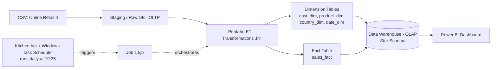

# 📊 Automated End-to-End Data Pipeline for Online Retail Analytics

**A Data Engineering / ETL Project**

This project implements a complete **ETL (Extract, Transform, Load) data pipeline** for the *Online Retail II* dataset — covering raw data ingestion, data cleaning & transformation with **Pentaho Data Integration (PDI/Kettle)**, dimensional modeling into a **Star Schema** on **MySQL**, fully automated daily orchestration via **Kitchen.bat + Windows Task Scheduler**, and interactive analytics served through **Power BI**.

The core focus of this project is building a production-style **ETL and data warehousing workflow**: turning messy, duplicated, inconsistent transactional data into a clean, query-optimized data warehouse that powers reliable business intelligence.

---

## 📝 Project Overview

Raw retail transaction data is typically noisy — full of duplicates, missing values, and inconsistent formatting — which makes it unsuitable for direct analysis. This project builds an **ETL pipeline** that processes **~400,000 transactions** from the *Online Retail II* dataset (2010–2011, Kaggle) into a form that is reliable, structured, and ready for business analysis.

The ETL flow:
1. **Extract** — raw CSV data is loaded into a staging (OLTP) database.
2. **Transform** — data is deduplicated, validated, and standardized (removing invalid transactions, fixing string formatting, handling missing IDs/descriptions) before being reshaped into a **Star Schema**.
3. **Load** — cleaned data is loaded into a data warehouse (OLAP) consisting of one fact table and four dimension tables.
4. **Orchestrate & Automate** — the entire ETL process runs on a schedule via a Pentaho Job, triggered daily by Windows Task Scheduler.
5. **Serve** — the data warehouse is connected to Power BI for dashboarding and analytics.

---

## 🗂️ Repository Structure

```
Data Engineering ETL Project/
|──Data/
|   |── online_retail_ii.csv #raw data
|   └── Data.txt #database
├── OLTP (retail_dw)/                          # Staging-stage transformations (raw → clean)
│   ├── DataIngestionRaw.ktr
│   ├── Cleaned.ktr
│   └── Aggregat&Grouping.ktr
├── OLAP (retail_db)/                          # Dimension & fact table transformations (Star Schema)
│   ├── cust_dim.ktr
│   ├── ProductDim.ktr
│   ├── CountryDim.ktr
│   ├── DateDim.ktr
│   ├── SalesFact.ktr
│   └── Job 1.kjb                              # Master job (load orchestration order)
├── AutomationResult with Kitchen + WindowsScheduler/
│   ├── ETL_LAUNCHER_MARIA.bat                 # CLI script to run the ETL job via Kitchen
│   └── Screenshot (*).png                     # Evidence of job execution & scheduled runs
├── PBI Project.pbix                           # Power BI dashboard file
|── Data Engineering Presentation.pdf          # A presentation of the ETL Process & Business Insights                  
├── FINAL PAPER.pdf                            # Full technical/academic paper
└── READ ME.pdf                                # Original notes with database & Power BI links
```

---

## 🏗️ Data Pipeline Architecture



Storage is designed in two layers:
- **Raw Data Store (staging)** — keeps the original data untouched, simplifying verification and recovery.
- **Processed Data Store (data warehouse)** — holds the modeled Star Schema data, ready for Power BI consumption.

---

## ⭐ Star Schema Design

- **Fact table:** `sales_fact` — stores numeric transaction data (quantity, price, total sales) plus foreign keys to every dimension table.
- **Dimension tables:**
  - `cust_dim` — customer data (SCD Type 1)
  - `product_dim` — product data (SCD Type 2, using a `product_code` surrogate key)
  - `country_dim` — transaction location data
  - `date_dim` (`time_dim`) — date broken down into Year, Month, Week, Day, Quarter

The pipeline uses an **incremental load strategy** based on an `etl_metadata` table that tracks `LastLoadDate`, so only new or changed records are processed on each run.

---

## ⚙️ Tech Stack

| Category | Tools |
|---|---|
| ETL | Pentaho Data Integration (Kettle / Spoon / Kitchen) |
| Database | MySQL (staging & data warehouse) |
| Orchestration | Pentaho Job (`.kjb`) |
| Automation | Kitchen.bat (CLI) + Windows Task Scheduler (daily, 19:35) |
| Visualization | Power BI |
| Scripting | JavaScript (Modified JavaScript Value step in Pentaho, for fiscal quarter calculation) |

---

## 🚀 How to Run the Pipeline

**Prerequisites:**
- Pentaho Data Integration (Spoon/Kitchen) installed
- Java JDK (script references `jdk-25.0.2`)
- MySQL Server (for the `retail_dw` staging database and `retail_db` warehouse)
- Power BI Desktop (to open `PBI Project.pbix`)

**Steps:**
1. Update the database connection settings in each `.ktr` file (host, user, password) to match your local environment.
2. Run `Job 1.kjb` manually via Spoon for testing, **or**
3. Run it via CLI using `ETL_LAUNCHER_MARIA.bat` (update the `JAVA_HOME` path and the location of `Job 1.kjb` / `launcher.jar` to match your setup).
4. For daily automation, register the `.bat` file with **Windows Task Scheduler**.
5. Open `PBI Project.pbix` and refresh the data source connection to view the latest dashboard.

> ⚠️ The `.sql` database dump is **not included in this repository** due to file size limits — it's available via the Google Drive link below.

---

## 🔗 Related Links

- **Database (.sql):** [Google Drive](https://drive.google.com/drive/folders/1y7ep0jES0kBgJ6vaaNBM3hZ2ClxGmFTd?usp=drive_link)
- **Power BI Report (online):** [Power BI Service](https://app.powerbi.com/groups/me/reports/6833f003-82b3-48f4-a03e-cdd428e92e62/4d3e1a554ace3ccbc8b8?experience=power-bi) *(requires access/login)*

---

## 📈 Key Insights from the Dashboard

- **Total revenue:** $8.75 million from **5 million units sold**, averaging **$475.50 per order**.
- The **"Paper Craft"** category accounts for ~28% of revenue among the top 5 products; **"PaperCraft Little Birdie"** is the best-selling product by both volume and average price.
- The **United Kingdom** leads in sales volume; the **Netherlands** holds the highest market share (26.63%) with the highest average selling price.
- **Cohort analysis** shows a sharp customer retention drop (11%–36%) after the first month, pointing to a need for post-purchase loyalty programs.
- The **December 2010** cohort shows the strongest long-term retention, suggesting year-end promotions were effective at retaining customers.
- **EIRE** has the highest average revenue per customer (~$100,000), making it a strong candidate for future loyalty initiatives.
- The Q4 2011 revenue surge was driven by **more transactions and a larger customer base**, not by higher prices or average order value.

---

## 🔮 Recommendations

- Introduce automated post-purchase loyalty programs to reduce the early customer retention drop.
- Prioritize the EIRE market as a testing ground for loyalty strategies.
- Replicate the 2010 year-end promotional pattern in early Q1 of the following year to sustain transaction volume.
- Migrate the pipeline to a distributed processing framework such as **Apache Spark** to support future real-time/streaming data needs.

---

## 📄 Full Documentation

Detailed methodology, literature review, and evaluation are available in [`FINAL PAPER.pdf`](./FINAL%20PAPER.pdf).

---

## 📜 License

This project was built for academic purposes as part of a Data Engineering course and is not intended for commercial use.
